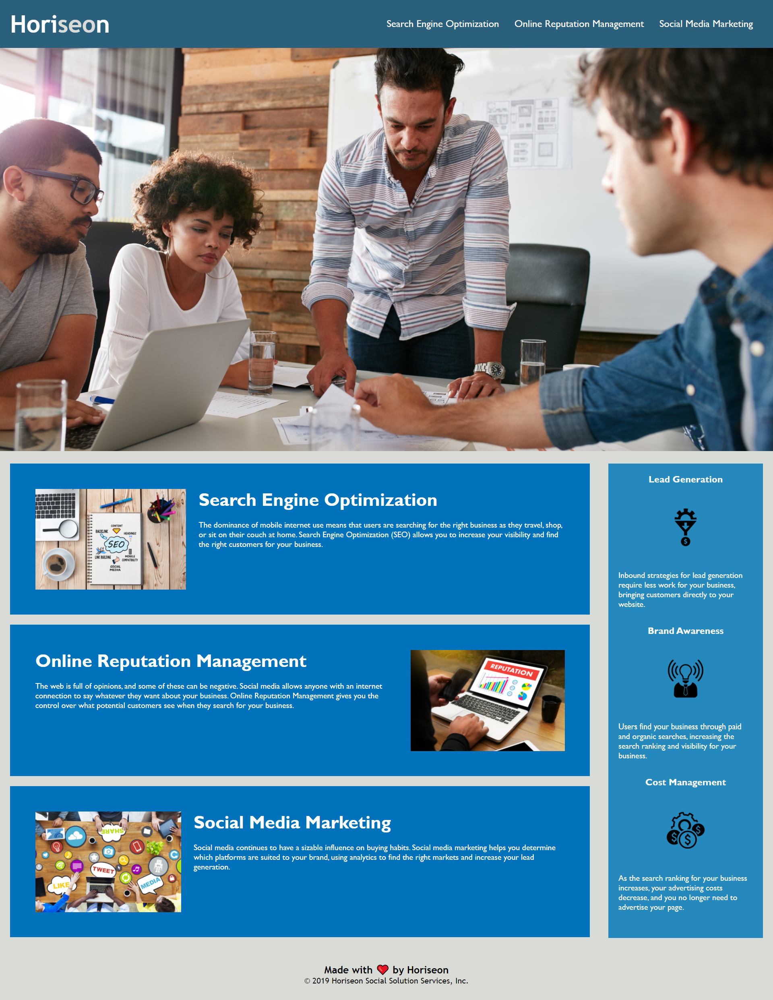

# Horiseon Website Refactor

Deployed Application: https://adriancronin.github.io/horiseon-website/

## Description
A simple webpage with optimized CSS selectors with semantic and accessible HTML.
* Motivation for this project was to increase accessibility to a broader audience
* HTML is now more semantic and accessible to users with assistive tools such as screen readers
* I learned to keep in mind that not all users will be able to use features the exact same way or with the same hardware

## Usage
